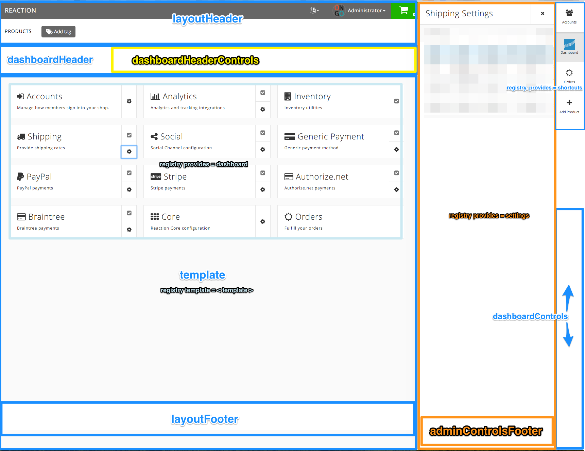

# Layout

Layouts are a combination a `layout` and a series of `workflow` elements. 

The layout will render a Blaze template as defined in the layout structure.

The workflow elements will be rendered with the `ReactionTemplates` helper, and are meant to be used in combination with the layout structure.

## Package Registry - Layout
From a `Packages.registry` document as defined in the `reaction-checkout` package.

```javascript
  layout: [{
    layout: "coreLayout",
    workflow: "coreCartWorkflow",
    collection: "Cart",
    theme: "default",
    enabled: true,
    structure: {
      template: "cartCheckout",
      layoutHeader: "checkoutHeader",
      layoutFooter: "",
      notFound: "notFound",
      dashboardHeader: "",
      dashboardControls: "dashboardControls",
      dashboardHeaderControls: "",
      adminControlsFooter: "adminControlsFooter"
    }
  }, {
    template: "checkoutLogin",
    label: "Login",
    workflow: "coreCartWorkflow",
    container: "checkout-steps-main",
    audience: ["guest", "anonymous"],
    priority: 1,
    position: "1"
  }, {
    template: "checkoutAddressBook",
    label: "Shipping Billing",
    workflow: "coreCartWorkflow",
    container: "checkout-steps-main",
    audience: ["guest", "anonymous"],
    priority: 2,
    position: "2"
  }, {
    template: "coreCheckoutShipping",
    label: "Shipping Options",
    workflow: "coreCartWorkflow",
    container: "checkout-steps-main",
    audience: ["guest", "anonymous"],
    priority: 3,
    position: "3"
  }, {
    template: "checkoutReview",
    label: "Review Payment",
    workflow: "coreCartWorkflow",
    container: "checkout-steps-side",
    audience: ["guest", "anonymous"],
    priority: 4,
    position: "4"
  }, {
    template: "checkoutPayment",
    label: "Complete",
    workflow: "coreCartWorkflow",
    container: "checkout-steps-side",
    audience: ["guest", "anonymous"],
    priority: 5,
    position: "5"
  }]
});
```
### CoreLayout 


